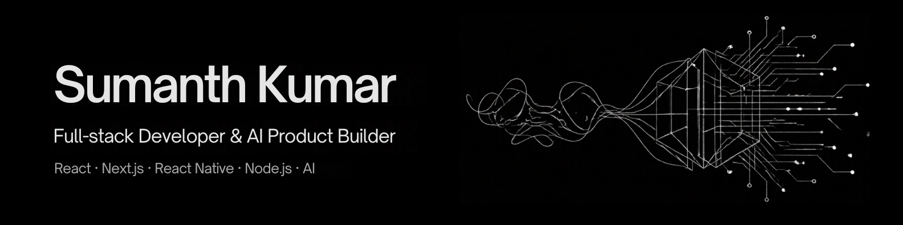

  

  
  
  
  
  

  
  
  

---

### 👋 About me

I'm **Sumanth**, a full-stack developer and AI product builder from **Mangalore, India**. I design and build real products for web and mobile, from the Figma file to the Play Store listing.

- 💼 **Associate MERN Stack Developer & Test Engineer** at **Mirchi35**, where I've shipped two Android apps (React Native + Expo) to Google Play
- 🚀 **Founder** of [eMenu](https://emenuweb.com/), a digital menu SaaS for restaurants
- 🧪 **Co-founder** of [Auralion Labs](https://auralionlabs.com/), a product studio for AI, web, mobile and SaaS
- 🎨 Freelance product and UI/UX design: Figma → React / React Native
- 🤖 Lately: agentic workflows, AI-powered features, and on-device AI in the browser
- 🎓 BCA in AI & Machine Learning, Manipal University Jaipur (2024 – 2027)

 

  

---

### 🛠️ Tech stack

   
   
  

  <b>Mobile:</b> React Native · Expo · Ionic · Capacitor &nbsp;·&nbsp; <b>AI:</b> Agentic systems · Transformers.js · Gemini · Google ADK

---

### 📱 Featured work

| Project | What it is | Link |
|---|---|---|
| 🛍️ **Mirchi35 Studio** | Vendor app for a live local-discovery platform (React Native + Expo) | [Google Play](https://play.google.com/store/apps/details?id=com.mirchi35.studio) |
| 🌐 **Mirchi35 Community Connect** | Multi-language community app (React Native + Expo) | [Google Play](https://play.google.com/store/apps/details?id=com.mirchi35.pulse) |
| 🍽️ **eMenu** | QR digital menu SaaS I founded (Next.js, Supabase, Stripe) | [emenuweb.com](https://emenuweb.com/) |
| 🦁 **Auralion Labs** | My product studio's website (Next.js, GSAP, Sanity) | [auralionlabs.com](https://auralionlabs.com/) |
| 🗺️ **Scavenge** | Real-world scavenger hunts with GPS and leaderboards | [scavenge.rs](https://scavenge.rs/) |
| 🩺 **Wren** | Agentic healthcare assistant *(hackathon)* (Gemini + Google ADK) | [Devpost](https://allthingsagentichackathon.devpost.com/) |

<b>More projects</b>

 

[GT-Five](https://play.google.com/store/apps/details?id=com.gtfive.gtfive_app) (app UI/UX & branding) · [Vakya](https://vakya.fun/) · [Oryx AI](https://oryx-ai.vercel.app/) · [Code Stack](https://codestack-sigma.vercel.app/) · [image-π](https://image-pi-dusky.vercel.app/) · [Salary Split](https://salary-split-three.vercel.app/)

---

### ✨ My portfolio

Hand-built in plain HTML, CSS and JavaScript: animated scenes of how I ship, a droid assistant with an on-device AI brain, and every project I've built. **[Visit it →](https://sumanth-kumar-portfolio.vercel.app/)** · [Source](https://github.com/Skarycloud/SumanthKumar_Portfolio)

  
  
  

---

### 📊 GitHub stats

  

  

  <picture>
    <source media="(prefers-color-scheme: dark)" srcset="https://raw.githubusercontent.com/Skarycloud/Skarycloud/output/github-snake-dark.svg" />
    <source media="(prefers-color-scheme: light)" srcset="https://raw.githubusercontent.com/Skarycloud/Skarycloud/output/github-snake.svg" />
    
  </picture>

---

  <b>Have a product idea, need a web or mobile app, or want to build something with AI?</b> 
  <a href="mailto:sumanth.k.0202@gmail.com">sumanth.k.0202@gmail.com</a>

